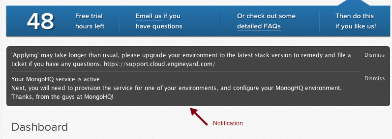
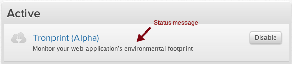

#Guidelines for platform services messages

*Document status as of 2012.01.10: Because the platform services feature is pre-alpha, the content of this document is not final.* 

The purpose of this document is to:  

* Inform platform-service providers about the types of messages that they can use to communicate with Engine Yard Cloud users.
* Provide guidelines about how platform-service providers should write and use these messages.

### Table of contents

      0.1 About platform-service messages  
      0.2 How your service is identified  
    1.0 Alerts  
      1.1 Example 1: Alert message  
    2.0 Notification messages  
      2.1 Example 1: Notification message  
      2.2 Example 2: Notification message  
      2.3 Example 3: Notification message  
    3.0 Status messages  
      3.1 Example 1: Status message  
    4.0 Rules for writing Engine Yard Cloud messages  
      4.1 Lean, lean, lean   
      4.2 Word choice  
      4.3 Verbs  
      4.4 Person  
      4.5 Adjectives  
      4.6 Capitalization  
      4.7 Punctuation  

### 0.1 About platform-service messages

There are three kinds of messages that platform services can show to Engine Yard Cloud users:  

* **Alerts**. Sent by email to all members of the account. Alerts also appear in red on the Dashboard.
* **Notifications**. Appear on the Dashboard until dismissed.
* **Status messages**. Persist on the Services page.

### 0.2 How your service is identified

On the Dashboard, alert and notification messages are automatically prefaced by the service name. This gives the reader context for the message. It also means that you don’t need to include the service name in the message text.

    <Service name> service: <message subject> Visit <Service name>. 
    <message body>

Status messages appear under the name of the service and so are not prefaced by the service name. 

## 1.0 Alerts

Alerts are for **critical** and **urgent** information only. In addition to appearing with emphasis in the Dashboard, alerts are sent by email to all members of the account. Alerts use Textile so that links can be included. However, **all other formatting is discouraged and ultimately stripped out.**

On the Dashboard, alerts are not distinguishable from Notifications. The difference is that for an alert an email is sent to all members of the account.  

Examples of when an alert might be needed:  

* Data loss  
* Site down  
* Storage limit reached  

Use alerts sparingly.

Make sure that the alert message explains the problem in layman’s terms and clearly states what action needs to be taken by the reader.

Here is the syntax for the email message associated with an alert:

Subject:  

    Alert from <Service name>: <message subject>

Body:  

    Message from <Service name>:
    <message body>

    Configure <Service name> at: <configuration_url>

### 1.1 Example 1: Alert message

**Before ( 112 characters):**

Service Librato Metrics failed to be enabled due to errors: An unexpected error occured; please try again later.

**After (57 characters):**

Librato Metrics service: Failed to be enabled. Try again later or contact Support.

**Comments:** 

Spellcheck messages. (Here, occurred was misspelled.)  
Think about how the message will appear to the reader. If there is an error, trying again later may never solve the problem.

## 2.0 Notification messages

Notifications appear on every page of Engine Yard Cloud. A service can have multiple notifications at a time.

Notification messages tell users about actions that they can or need to take. 

Notification messages should be less than 256 characters and use Textile so that links can be included, but all other formatting is discouraged and ultimately stripped out.

### 2.1 Example 1: Notification message

**Before (458 characters):**

A Librato Metrics ID has been created for your account. Provisioning Metrics for an application will automatically populate the LIBRATO\_METRICS\_USER and LIBRATO\_METRICS\_TOKEN environment variables. These are jdoe@services.engineyard.com and jba537e9345fd47213a72144a respectively. Additionally, you may want to log in to http://metrics.librato.com directly to manage your account: to do this use your ID and the generated password: fb1901466cb8ffbb. Thanks!

**After (241 characters):**

Librato Metrics service: Your account has been activated. Visit Librato Metrics.
Provisioning metrics for the application populates the LIBRATO\_METRICS\_USER and LIBRATO\_METRICS\_TOKEN configuration variables. For more information, see Getting Started with Engine Yard.

**Comments:** 

The Before example is wrong to post the specific values for METRICS\_USER, METRICS\_TOKEN, password, etc. There is a place in the UI to view these. The Message should direct the user there.

### 2.2 Example 2: Notification message

**Before (179 characters):**

Your MongoHQ service is active 
Next, you will need to provision the service for one of your environments, and configure your MonogHQ environment. Thanks, from the guys at MongoHQ!

**After (105 characters):**

MongoHQ service: Activated. Provision the service for your Engine Yard environment and configure your MongoHQ environment.

**Comments:** 

Delete the superfluous words. Change future tense to present tense. Use the imperative. Distinguish between the two kinds of environments. Delete “Thanks”. Respect your product name by spelling it correctly. ;)

### 2.3 Example 3: Notification message

**Before (134 characters):**

Tronprint Activated 
A Brighter Planet account was created for you so that you can begin enabling your web applications with Tronprint.

**After (79 characters):**

Tronprint service: Your Brighter Planet account is ready. Enable your applications with Tronprint.

**Comments:** 

Trim words. Use the imperative. 

## 3.0 Status messages

Status messages appear under the name of the service on the Services page.
The purpose of the status message is to inform the user about the current state of the service. Only one status message is displayed at a time.

Status messages should be sent in Textile. Plaintext is accepted and will be wrapped in HTML paragraph tags.

### 3.1 Example 1: Status message

**Before:**

Monitor your web application’s environmental footprint

**After:**

Monitor the environmental footprint of your application.

**Comments:**

If a status message is a sentence, put a period at the end of it. Use “application” instead of “web application”. In the context of Engine Yard, all applications are web applications. Avoid long noun strings and possessives on inanimate objects. 

## 4.0 Rules for writing Engine Yard Cloud messages

Here are some important guidelines.

### 4.1 Lean, lean, lean

People do not read long messages. 
Use as few words as possible in your message. The longer the message, the less likely that anyone will read it.

Write the first draft of the message, and then ask a colleague to rewrite it using fewer words.

### 4.2 Word choice

Don’t use these words:  

* all
* as (don’t use instead of because)
* customer (don’t use to refer to the reader of the message, use you)
* db (use database)
* easy
* every
* hit (use click)
* in order to (use to)
* may (use can or might instead)
* once (use after)
* please
* press (use click)
* thank you
* thanks
* simple
* since (use because, unless referring to time)
* user (don’t use to refer to the reader of the message, use you)
* utilize (use use)
* web application (use application — web application is not wrong _per se_ but consistent use of application improves reader comprehension)
* wish (use want)
* & (use and)

### 4.3 Verbs

Use the present tense. (If something is happening very soon, don’t use the future tense, use the present tense.)

“If you knock over the glass, the milk spills.” vs. “If you don’t floss your teeth, you will get gum disease.”  

Use the active voice and the imperative.  
Click <widget text> (Not “Click on the <widget text> button.”)

Avoid should, could, would and difficult tenses. 

### 4.4 Person

Write directly to the user.

Address the reader as you or with the imperative.   
For example, “Click Dismiss.” And, not “The customer should click dismiss.”

### 4.5 Adjectives

Avoid adjectives where possible.  
For example, write “Select the database.” instead of  “Select the appropriate database.”

### 4.6 Capitalization

Don’t capitalize the first letter of a word unless it starts a sentence or is the name of a product or company.

Respect trademarks and product names.

For example, write "Engine Yard Cloud", not "Cloud" or "EY Cloud" or "Engine Yard" if you are referring to the product and not the company).  

### 4.7 Punctuation

Use the serial comma.  
Don’t use exclamation marks.

